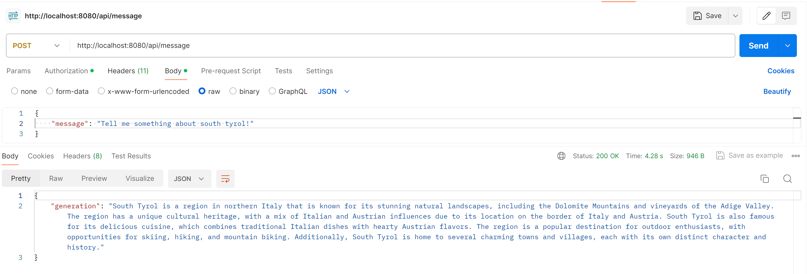
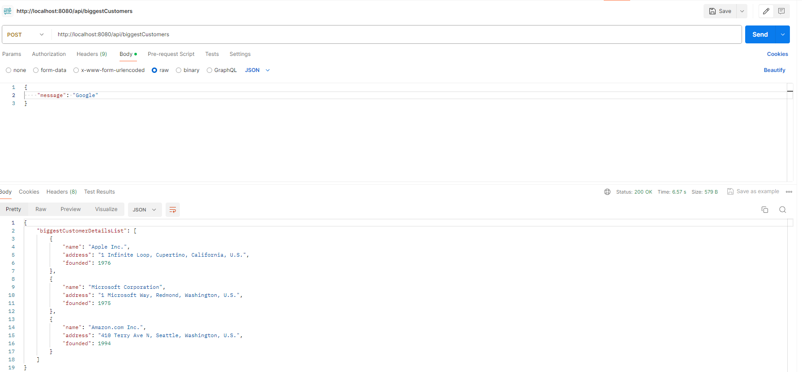
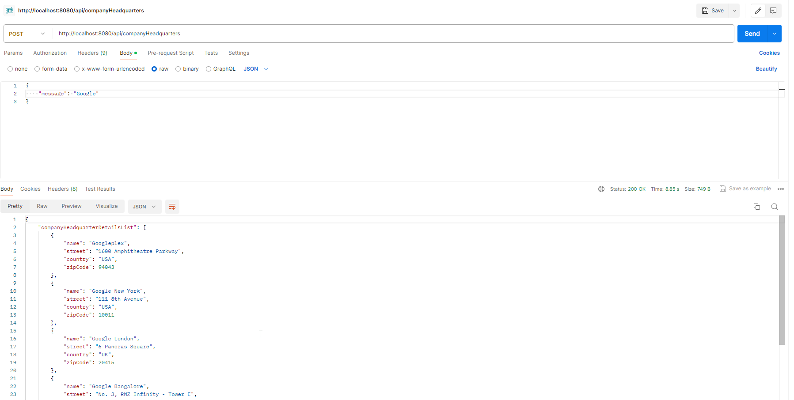
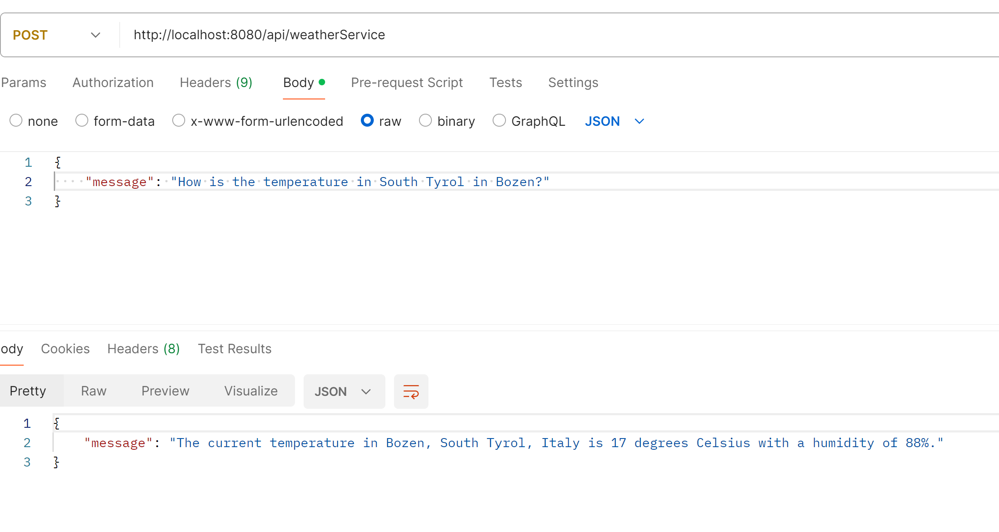
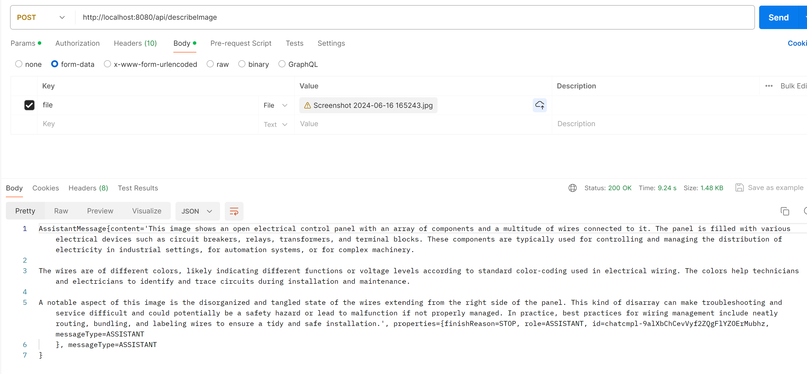
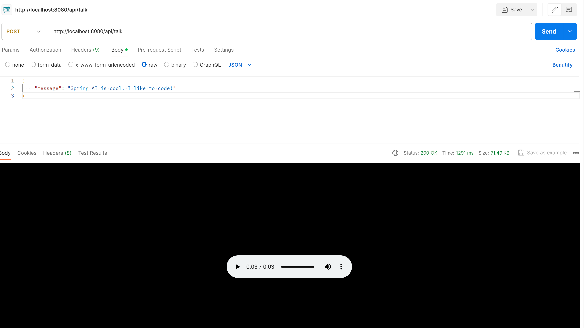
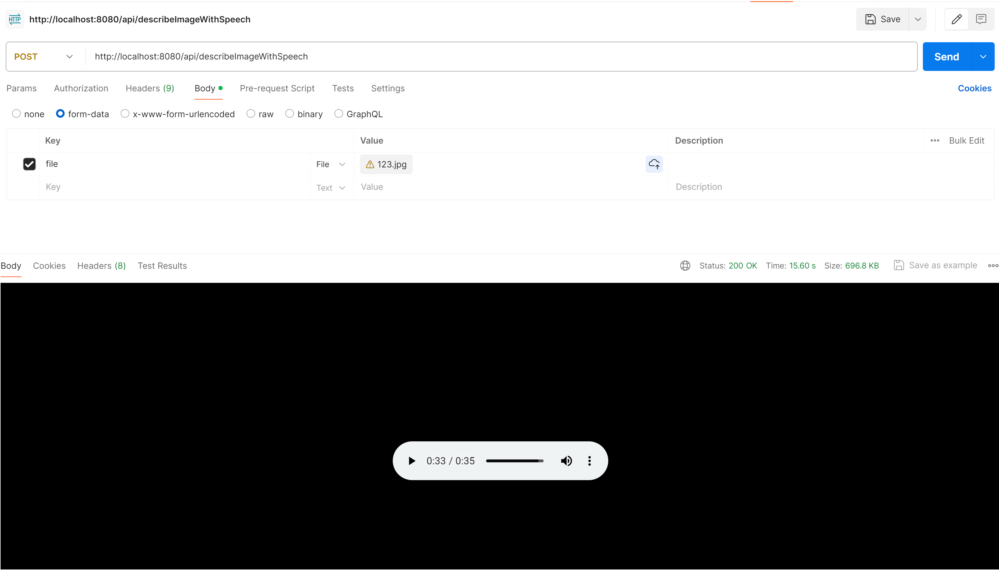
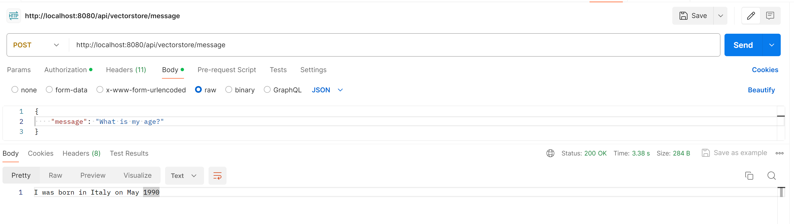

# spring-ai-chat-bot
The project offers an API to generate a chat response on a given conversation and is able to generate pictures out of text. 
In addition it shows an example to use a vectorstore for custom data.
There are some .st templates used to generate the question and responses in a defined format with POJO classes.

To demonstrate the usage of OpenAiFunction an endpoint /weatherService is available which shows how to load actual data from an API, with the request and response build from the model, and give them to the OpenAi to generate the final response.

With OpenAI vision it is possible to let AI describe the content of a picture. To demonstrate it, there is a endpoint /describeImage available. 

#### API POST-Request:

http://localhost:8080/api/generalMessage



http://localhost:8080/api/biggestCustomers



http://localhost:8080/api/companyHeadquarters



http://localhost:8080/api/image


http://localhost:8080/api/weatherService



http://localhost:8080/api/describeImage



http://localhost:8080/api/talk


http://localhost:8080/api/describeImageWithSpeech


http://localhost:8080/vectorstore/message



## Vectorstore for custom data in PostgreSql

```
CREATE EXTENSION IF NOT EXISTS vector;
CREATE EXTENSION IF NOT EXISTS hstore;
CREATE EXTENSION IF NOT EXISTS "uuid-ossp";

CREATE TABLE IF NOT EXISTS vector_store (
id uuid DEFAULT uuid_generate_v4() PRIMARY KEY,
content text,
metadata json,
embedding vector(1536)
);

CREATE INDEX ON vector_store USING HNSW (embedding vector_cosine_ops);
```
